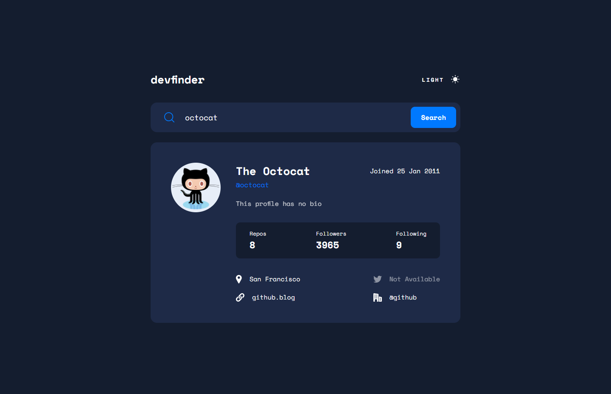
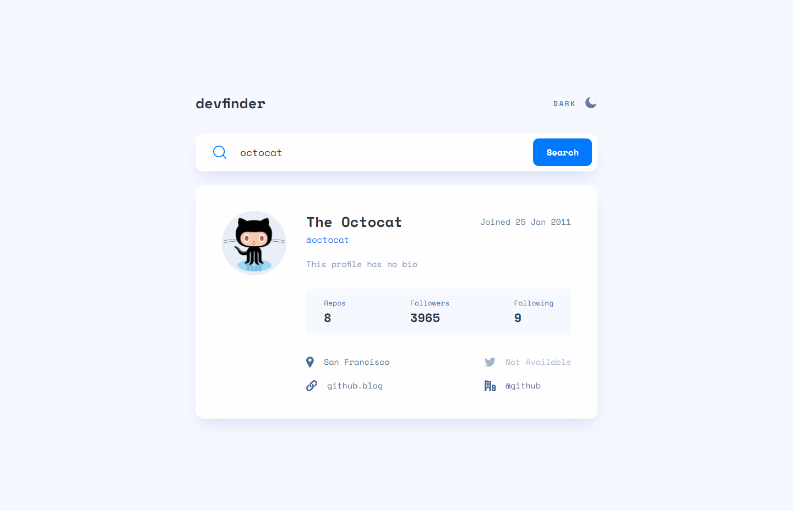
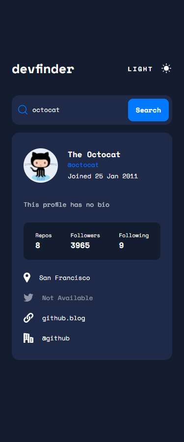

# Frontend Mentor - GitHub user search app solution

This is a solution to the [GitHub user search app challenge on Frontend Mentor](https://www.frontendmentor.io/challenges/github-user-search-app-Q09YOgaH6). Frontend Mentor challenges help you improve your coding skills by building realistic projects.

## Table of contents

- [Overview](#overview)
  - [The challenge](#the-challenge)
  - [Expected behaviour](#expected-behaviour)
  - [Screenshot](#screenshot)
  - [Links](#links)
- [My process](#my-process)
  - [Built with](#built-with)
  - [What I learned](#what-i-learned)
- [Author](#author)

## Overview

### The challenge

Users should be able to:

- View the optimal layout for the app depending on their device's screen size
- See hover states for all interactive elements on the page
- Search for GitHub users by their username
- See relevant user information based on their search
- Switch between light and dark themes
- Have the correct color scheme chosen for them based on their computer preferences.
- Persist theme with localStorage

The GitHub users API endpoint is `https://api.github.com/users/:username`. So, if you wanted to search for the Octocat profile, you'd be able to make a request to `https://api.github.com/users/octocat`.

### Expected behaviour

- On first load, show the profile information for NinjaInShade (me).
- Display an error message (as shown in the design) if no user is found when a new search is made.
- If a GitHub user hasn't added their name, show their username where the name would be without the `@` symbol and again below with the `@` symbol.
- If a GitHub user's bio is empty, show the text "This profile has no bio" with transparency added (as shown in the design). The lorem ipsum text in the designs shows how the bio should look when it is present.
- If any of the location, website, twitter, or company properties are empty, show the text "Not Available" with transparency added (as shown in the design).
- Website, twitter, and company information should all be links to those resaources. For the company link, it should remove the `@` symbol and link to the company page on GitHub. For Octocat, with `@github` being returned for the company, this would lead to a URL of `https://github.com/github`.

### Screenshot





### Links

- Solution URL: (https://www.frontendmentor.io/solutions/responsive-github-api-user-search-api-with-darklight-theme-switch-rqG2i-9TT)
- Live Site URL: (https://lm-github-user-search.netlify.app/)

## My process

### Built with

- Semantic HTML5 markup
- CSS custom properties/vars
- Desktop-first workflow
- Javascript
- Fetch API
- Github API

### What I learned

The fetching from the API part wasn't so hard. I did get confused for a second with promises and what was actually getting returned, but I figured it out.

The bulk of this project was spent structuring the dark/light theme modes, and colours in a clean and scalable manner.

I looked at the design file and calculated similar var names, so all I'd have to do no additional styling in the CSS file of that component, just switch the global CSS vars, and it would work. I used this by setting vars on body, and then overriding those vars in the body class if it also had a "dark-theme" class:

```css
body {
  display: flex;
  justify-content: center;
  align-items: center;
  background-color: var(--bg);
  min-height: 100vh;
  padding: 75px 96px;

  /* Lightmode */
  --primary: #0079ff;

  --txt-high-contrast: #2b3442;
  --txt-mid-contrast: #4b6a9b;
  --txt-low-contrast: #697c9a;

  --bg: #f6f8ff;
  --bg-secondary: #fefefe;

  --theme-switch-btn-hover: #222731;

  /* Neutral */
  --error: #f74646;
}

body.dark-theme {
  background-color: var(--bg);

  /* Darkmode */
  --primary: #0079ff;

  --txt-high-contrast: #fff;
  --txt-mid-contrast: #ffff;
  --txt-low-contrast: #fff;

  --bg: #141d2f;
  --bg-secondary: #1e2a47;

  --theme-switch-btn-hover: #90a4d4;

  /* Neutral */
  --error: #f74646;
}
```

I also set the default colour theme based on the users colour preference on their OS, using some Javascript:

```js
// If user has dark preference, set the dark theme by default.
const prefersDarkScheme = window.matchMedia('(prefers-color-scheme: dark)');

if (prefersDarkScheme.matches) {
  document.body.classList.add('dark-theme');
} else {
  document.body.classList.remove('dark-theme');
}
```

I then developed this bit of code even further to incorporate localStorage.

If the user changes the theme, this persists in localStorage. So, the next time they go to the site, it's on the theme they selected last. This should override any OS preference, which I took into consideration. This is what I coded for this:

```js
function initTheme() {
  // If user has dark preference, set the dark theme by default.

  // LocalStorage overrides this however, as the user has then changed the theme,
  // which we want to persist to those settings then.
  const prefersDarkScheme = window.matchMedia('(prefers-color-scheme: dark)');
  const storedTheme = localStorage.getItem('theme');

  if (storedTheme === 'dark') {
    ThemeSwitchTxt.innerText = 'Light';

    // Update theme classes toggles body class, and toggles the moon/sun icons to change over.
    return updateThemeClasses();
  }

  if (prefersDarkScheme.matches) {
    ThemeSwitchTxt.innerText = 'Dark';

    return updateThemeClasses();
  }
}
```

## Author

- Website - [Leon Michalak](https://www.leonmichalak.dev)
- Frontend Mentor - [@NinjaInShade](https://www.frontendmentor.io/profile/NinjaInShade)
- Instagram - [@TheFrontendGuy](https://www.instagram.com/thefrontendguy/)
